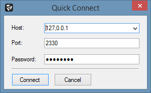

# Connecting to a Server

For users of battleWarden, there are different ways to connect to a game server. You can either use
the [Server Manager](managing-servers.md) or the [Quick Connect Toolbar](overview-main-application-window.md)
for connecting to game servers.

Another way is to use the Quick Connect feature you can access by clicking `Server` → `Quick Connect` in the
[Main Menu Bar]. Alternatively, press ++ctrl+q++. In the appearing dialog window (as depicted below), enter the
necessary server information (`Host`, `Port`, `Password`) and click `Connect`.

<figure markdown>
  
  <figcaption>Quick Connect Dialog Window</figcaption>
</figure>

!!! note

    The Quick Connect feature is the only way to connect to a server without saving it in the server manager.

[Main Menu Bar]: overview-main-application-window.md
