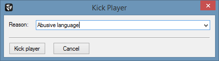
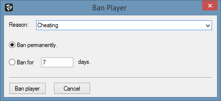
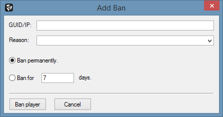

# Kicking & Banning

This section addresses the kicking and banning functionalities in battleWarden.

## Kicking Players

To kick a client/player connected to your server, right-click the according item in the player list under the `Players`
tab of the [Primary Tab Bar] and click `Kick`. In the appearing dialog window, enter a reason and click `Kick player`.

<figure markdown>
  
  <figcaption>Kick Player Dialog Window</figcaption>
</figure>

## Banning Players

To ban a client/player connected to your server, right-click the according item in the player list under the `Players`
tab of the [Primary Tab Bar] and click `Ban`. In the appearing dialog window, enter a reason followed by the duration
and click `Ban player`.

<figure markdown>
  
  <figcaption>Kick Ban Player Dialog Window</figcaption>
</figure>

## Adding Bans

The *Add Ban* feature enables you to ban a client/player from you server even when that client/player is not connected
to your server. To accomplish this, click `Commands` --> `Add Ban` in the [Main Menu Bar].
In the appearing dialog window, enter the BattlEye GUID or IP of the client/player, a reason, a duration and
click `Ban player`.

<figure markdown>
  
  <figcaption>Add Ban Dialog Window</figcaption>
</figure>

[Primary Tab Bar]: overview-main-application-window.md

[Main Menu Bar]: overview-main-application-window.md
