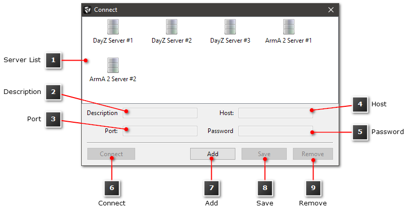

# Managing Servers

battleWarden features an integrated Server Manager allowing you to save your game servers you need to administrate.

In order to open the Server Manager, click `Server` --> `Connect` in the
[Main Menu Bar](overview-main-application-window.md) of the Main Application Window.
Alternatively, press ++ctrl+f++.

<figure markdown>
  
  <figcaption>Server Manager Dialog</figcaption>
</figure>
