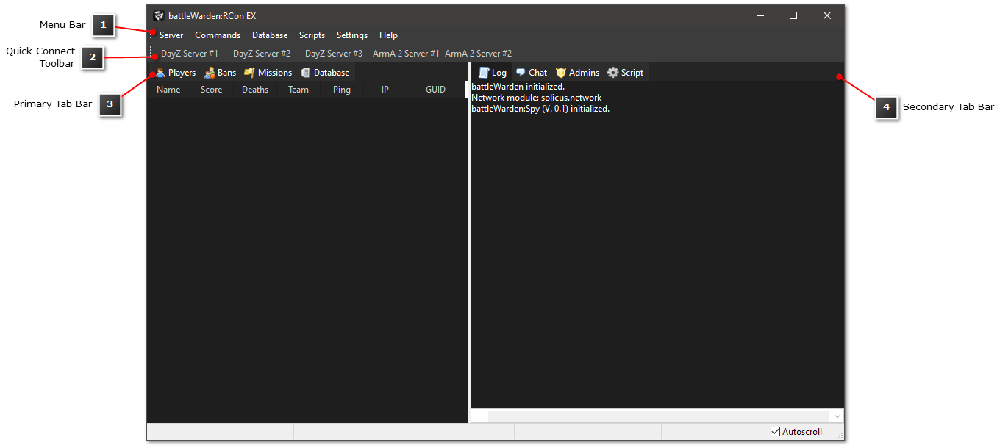

# Overview of the Main Application Window

When launching battleWarden the Main Application Window will appear as shown in the figure below.

<figure markdown>
  
  <figcaption>battleWarden Main Application Window</figcaption>
</figure>

The Main Application Window consists of the following parts enabling you to perform several tasks:

`Menu Bar` (also referred to as `Main Menu Bar`)

: Common tasks of battleWarden are accessible through the Menu Bar. These tasks include managing your game servers,
executing server commands, importing/exporting the player database, running scripts manually as well as changing the
settings of battleWarden.

`Quick Connect Toolbar`

: The Quick Connect Toolbar enables you to connect easily to your game servers you have configured using the
[Server Manager](managing-servers.md).

`Primary Tab Bar`

: Within the Primary Tab Bar you are able to view all clients connected to your game server and to manage your server
bans as well as configured missions. Furthermore, you can view the [database](../database/index.md) records.

`Secondary Tab Bar`

: The Secondary Tab Bar allows you to view the battleWarden application log, the ingame chat, list of admins connected
to your server and the script log.
